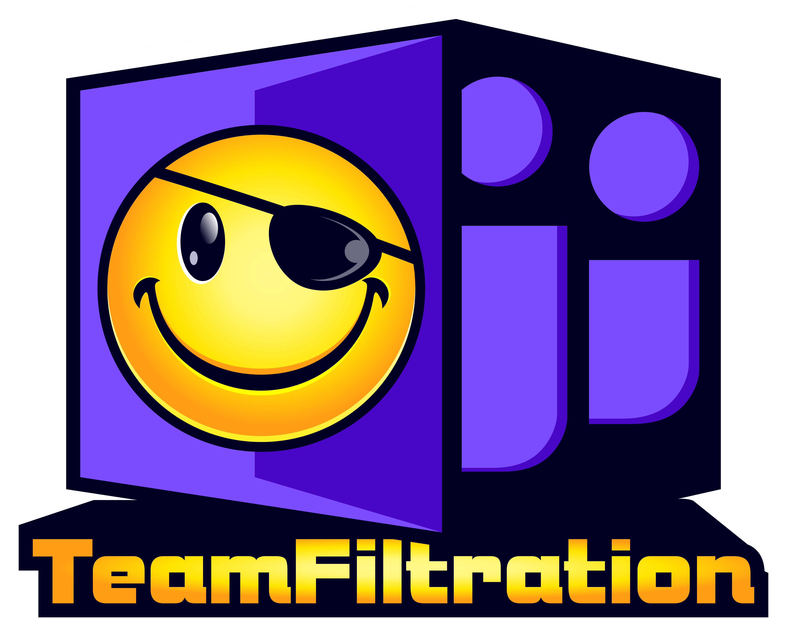

 <p align="center">
 
</p>

## TeamFiltration

TeamFiltration is a cross-platform framework for enumerating, spraying, exfiltrating, and backdooring O365 AAD accounts.
See the [TeamFiltration](https://github.com/Flangvik/TeamFiltration/wiki/Home) wiki page for an introduction into how TeamFiltration works and the [Quick Start  Guide](https://github.com/Flangvik/TeamFiltration/wiki/Home#quick-start-guide) for how to get up and running!

This tool has been used internally while working at TrustedSec since January 2021 and was publicly released in my talk [Taking a Dumb In The Cloud](https://youtu.be/GpZTQHLKelg) during DefCON30.

## Download
[You can download the latest precompiled release for Linux, Windows and MacOS ](https://github.com/Flangvik/TeamFiltration/releases/latest)   

**The releases are precompiled into a single application-dependent binary. The size go up, but you do not need NET or any other dependencies to run them.**

## Usage

```

  ╔╬╬╬╬╬╬╬╬╬╬╬╬╬╬╬╬╬╬╬╬╬╬╬╬╬╬╬╬╬╬╬╬╬╬╬╬╬╬╬╬╬╬╬╬╬╬╬╬╬╬╬╬╗
 ╬╬╬╬╬╬╬╬╬╬╬╬╬╬╬╬╬╬╬╬╬╬╬╬╬╬╬╬╬╬╬╬╬╬╬╬╬╬╬╬╬╬╬╬╬╬╬╬╬╬╬╬╬╬╬╬
╬╬╬╬┤                              ╠╬╬╝╬╬╬╬╬╬╬╬╬╬╬╬╬╬╬╬╬╬╬
╬╬╬╬╣                              │      ╬╬╬╬╬╬╬╬╬╬╬╬╬╬╬╬
╬╬╬╬╣                              ││      ╚╬╬╝╚ └╚╝╬╬╬╬╬╬
╬╬╬╬╣         ╔╦╦╬╬╬╬╬╬╦╦╗         ││       │        ╬╬╬╬╬
╬╬╬╬╣     ╔╬╬╬╝╝┘      ╚╝╝╬╬╬┐     ││       ││       └╬╬╬╬
╬╬╬╬┤    ╬╬╝╚╩╬╗╔          ╚╬╬╬    ││       ││        ╬╬╬╬
╬╬╬╬┤   ╬╝      ╚╬╬╗╗ ╔      ╚╬╗   ││      ├││        ╬╬╬╬
╬╬╬╬┤  ╬╬     ╔╗   ╚╬╬╬╬╬╬╦    ╬╬  │┌    ╔╬┤││       ╔╬╬╬╬
╬╬╬╬┤ ╔╬┤     ╬╬╬   ╬╬╬╬╬╬╬╬╝╝╝╬╬╗ ╠╬╬╬╬╬╬╬╬╬╗      ┌╬╬╬╬╬
╬╬╬╬┤ ╬╬┤     ╚╩┘   ╚╬╬╬╬╬╩    ╠╬╬ ╚╝╝╝╝╝╝╝╝╝╬╬╗╗╗╦╬╬╬╬╬╬╬
╬╬╬╬┤ ╬╬┤                      ╠╬╬ ││         ╬╬╬╬╬╬╬╬╬╬╬╬
╬╬╬╬┤  ╬╬   ╦╗            ╗╗   ╬╬  ││         │       ╬╬╬╬
╬╬╬╬┤  └╬┐   ╚╬╗╗      ╔╬╬╝   ╔╬┘  ││         │       ╬╬╬╬
╬╬╬╬┤   └╬╗    ╚╩╩╬╬╬╩╩╝╝   ╔╬╬    ││         │       ╬╬╬╬
╬╬╬╬┤    ╚╬╬╬╗           ┌╗╬╬╝┘    ││         │       ╬╬╬╬
╬╬╬╬┤       ╚╩╬╬╬╦╦╦╦╦╦╬╬╬╝╝       ││         │       ╬╬╬╬
╬╬╬╬┤            ╚╚╝╝╝╝            ││         │       ╬╬╬╬
╬╬╬╬┤                              ││         │    ╔╗╬╬╬╬╬
╬╬╬╬┤                              ││         ╬╦╦╬╬╬╬╬╬╬╬╬
╬╬╬╬┤                              ││     ╔╬╬╬╬╬╬╬╬╬╬╬╬╬╬╬
╬╬╬╬┤                              ╬╬╬╗╬╬╬╬╬╬╬╬╬╬╬╬╬╬╬╬╬╬╬
╬╬╬╬╬╬╬╬╬╬╬╬╬╬╬╬╬╬╬╬╬╬╬╬╬╬╬╬╬╬╬╬╬╬╬╬╬╬╬╬╬╬╬╬╬╬╬╬╬╬╬╬╬╬╬╬╬╬
 └╬╬╬╬╬╬╬╬╬╬╬╬╬╬╬╬╬╬╬╬╬╬╬╬╬╬╬╬╬╬╬╬╬╬╬╬╬╬╬╬╬╬╬╬╬╬╬╬╬╬╬╬╬╬╝
   ╝╝╝╝╝╝╝╝╝╝╝╝╝╝╝╝╝╝╝╝╝╝╝╝╝╝╝╝╝╝╝╝╝╝╝╝╝╝╝╝╝╝╝╝╝╝╝╝╝╝╝╝

[❤] TeamFiltration V3.5.4 PUBLIC, created by @Flangvik at @KovertNO, @TrustedSec
[+] Args parsed 
Usage:

   --outpath     Output path to store database and exfiltrated information (Needed for all modules)

   --config      Local path to your TeamFiltration.json configuration file, if not provided will load from the current path

   --exfil       Load the exfiltration module

         --username            Override to target a given username that does not exist in the database
         --password            Override to target a given password that does not exist in the database
         --tokens              Override to target a (file with newline seperated JWT tokens|single JWT| , seperated JWT tokens) and perfom exfiltration
         --cookie-dump         Override to target a given account using it's refresh-cookie-collection

         --all                 Exfiltrate information from ALL SSO resources (Graph, OWA, SharePoint, OneDrive, Teams)
         --aad                 Exfiltrate information from Graph API (domain users and groups)
         --teams               Exfiltrate information from Teams API (files, chatlogs, attachments, contactlist)
         --teams-db            Exfiltrate cookies and authentication tokens from an exfiltrated Teams database
         --onedrive            Exfiltrate information from OneDrive/SharePoint API (accessible SharePoint files and the users entire OneDrive directory)
         --owa                 Exfiltrate information from the Outlook REST API (The last 2k emails, both sent and received) 
               --owa-limit          Set the max amount of emails to exfiltrate, default is 2k.
         --jwt-tokens          Dump all gathered JSON formated JTW-tokens for SSO resources (MsGraph,AdGraph, Outlook, SharePoint, OneDrive, Teams)

   --spray       Load the spraying module

         --aad-sso             Use SecureWorks's Azure Active Directory password brute-forcing technique when spraying
         --us-cloud            When spraying companies attached to US Tenants (https://login.microsoftonline.us/)

         --passwords           Path to a list of passwords, common weak-passwords will be generated if not supplied
         --exclude             Path to a list of emails to exclude from spraying
         --seasons-only        Password genersated for spraying will only be based on seasons
         --months-only         Password generated for spraying will only be based on months
         --common-only         Spray with the top 20 most common passwords
         --shuffle-passwords   Shuffle the passwordlist before spraying
         --shuffle-users       Shuffle the target userlist before spraying
         --shuffle-regions     Shuffle FireProx regions when spraying

         --auto-exfil          If valid login is found, auto start the exfil module

         --sleep-min           Minimum minutes to sleep between each full rotation of spraying default=60
         --sleep-max           Maximum minutes to sleep between each full rotation of spraying default=100
         --jitter              Seconds between each individual authentication attempt. default=0
         --time-window         Defines a time windows where spraying should accour, in the military time format <12:00-19:00>
         --push                Get Pushover notifications when valid credentials are found (requires pushover keys in config)
         --push-locked         Get Pushover notifications when an sprayed account gets locked (requires pushover keys in config)
         --force               Force the spraying to proceed even if there is less the <sleep> time since the last attempt

   --enum        Load the enumeration module

         --domain              Domain to perfom enumeration against, names pulled from statistically-likely-usernames if not provided with --usernames
         --usernames           Path to a list of usernames to enumerate (emails)
         --dehashed            Use the dehashed submodule in order to enumerate emails from a basedomain
         --validate-msol       Validate that the given o365 accounts exists using the public GetCredentialType method (Very RateLimited - Slow 20 e/s)
         --validate-teams      Validate that the given o365 accounts exists using the Teams API method (Recommended - Super Fast 300 e/s)
         --validate-login      Validate that the given o365 accounts by attemping to login (Noisy - triggers logins - Fast 100 e/s)

   --backdoor        Loads the interactive backdoor module

   --database        Loads the interactive database browser module

   --debug           Proxy all outgoing HTTP requests through the proxy specified in the config

   Examples:

        --outpath C:\Clients\2024\FooBar\TFOutput --config myCustomConfig.json --spray --sleep-min 120 --sleep-max 200 --push --shuffle-users --shuffle-regions
        --outpath C:\Clients\2024\FooBar\TFOutput --config myCustomConfig.json --spray --push-locked --months-only --exclude C:\Clients\2021\FooBar\Exclude_Emails.txt
        --outpath C:\Clients\2024\FooBar\TFOutput --config myCustomConfig.json --spray --passwords C:\Clients\2021\FooBar\Generic\Passwords.txt --time-window 13:00-22:00
        --outpath C:\Clients\2024\FooBar\TFOutput --config myCustomConfig.json --exfil --cookie-dump C:\\CookieData.txt --all
        --outpath C:\Clients\2024\FooBar\TFOutput --config myCustomConfig.json --exfil --aad 
        --outpath C:\Clients\2024\FooBar\TFOutput --config myCustomConfig.json --exfil --tokens C:\\OutputTokens.txt --onedrive --owa
        --outpath C:\Clients\2024\FooBar\TFOutput --config myCustomConfig.json --exfil --teams --owa --owa-limit 5000
        --outpath C:\Clients\2024\FooBar\TFOutput --config myCustomConfig.json --debug --exfil --onedrive
        --outpath C:\Clients\2024\FooBar\TFOutput --config myCustomConfig.json --enum --validate-teams
        --outpath C:\Clients\2024\FooBar\TFOutput --config myCustomConfig.json --enum --validate-msol --usernames C:\Clients\2021\FooBar\OSINT\Usernames.txt
        --outpath C:\Clients\2024\FooBar\TFOutput --config myCustomConfig.json --backdoor
        --outpath C:\Clients\2024\FooBar\TFOutput --config myCustomConfig.json --database

```

## Credits

- [GitHub - KoenZomers/OneDriveAPI: API in .NET to communicate with OneDrive Personal and OneDrive for Business](https://github.com/KoenZomers/OneDriveAPI)
- [Research into Undocumented Behavior of Azure AD Refresh Tokens ](https://github.com/secureworks/family-of-client-ids-research) 
- [WS API Gateway management tool for creating on the fly HTTP pass-through proxies for unique IP rotation](https://github.com/ustayready/fireprox)
- Credits to [Ryan](https://twitter.com/detectdotdev) for validating and discussing my observations / questions!
- The entire [TrustedSec](https://TrustedSec.com) team for helping me polish this tool! 

